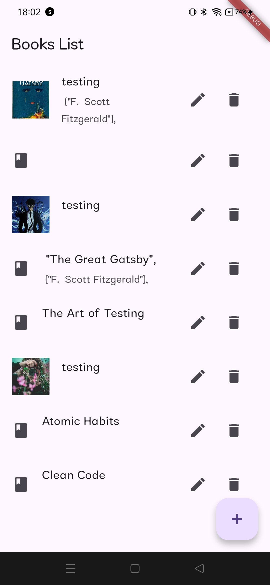

# Books-record-
Books Record with Api 
# 📚 ReadBuddy Flutter CRUD App

This is a Flutter-based CRUD application for managing books. It follows the **Clean Architecture** principles and uses **BLoC** for state management, along with **Dio** for API communication. Users can perform all CRUD operations (Create, Read, Update, Delete) on books.

---

##  Features

- List all books
- Add a new book
- Update existing book details
- Delete a book
- Clean folder structure with separation of concerns

---

##  Setup Instructions

create a flutter project with name booksrecord 

replace the content of lib folder with main.dart,core , features 

replace the pubsec yaml file 

##  Screenshots

| Home Screen | Add Book | Edit book|
|-------------|----------------|----------------|
|  |  |  |
